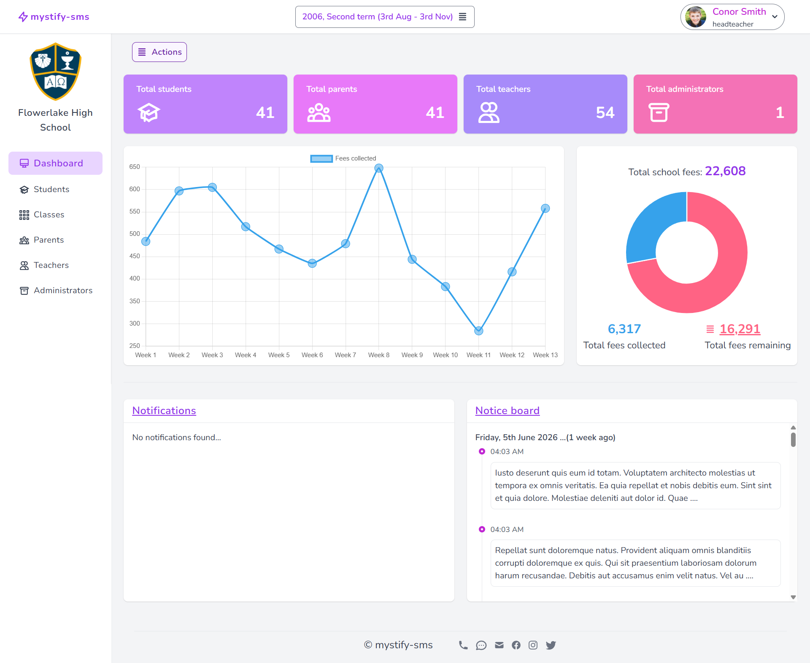
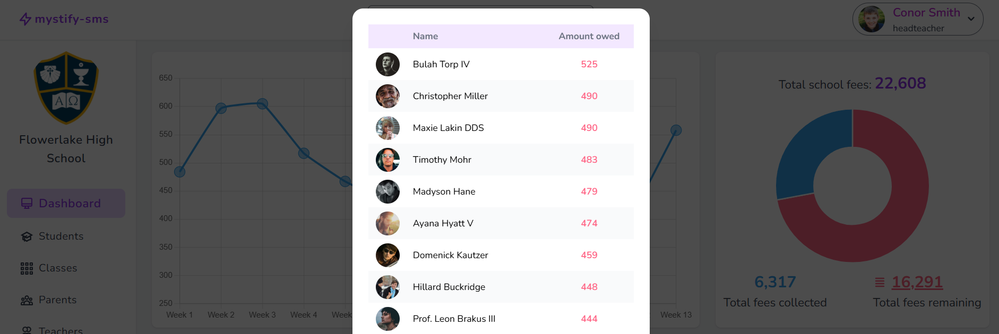
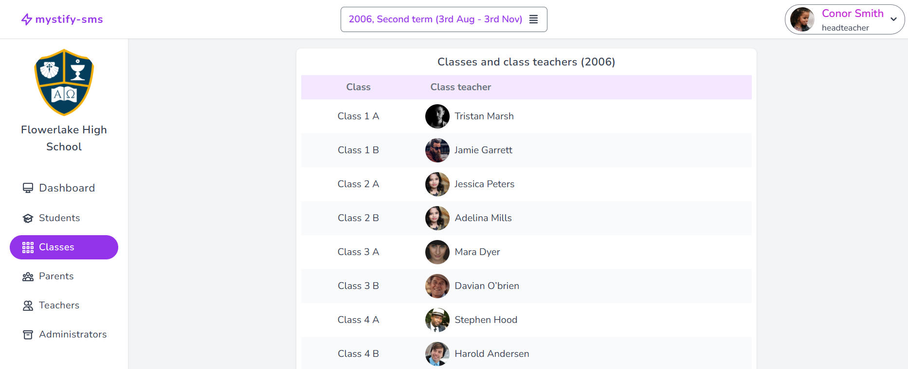
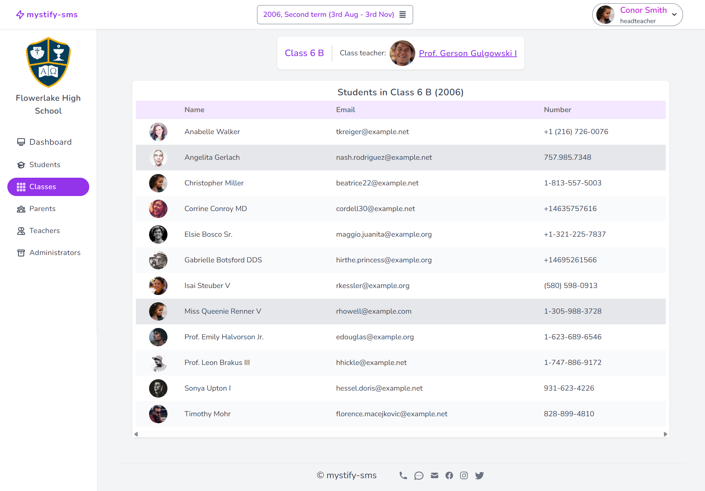
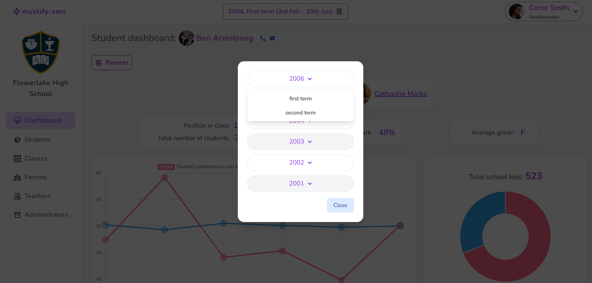
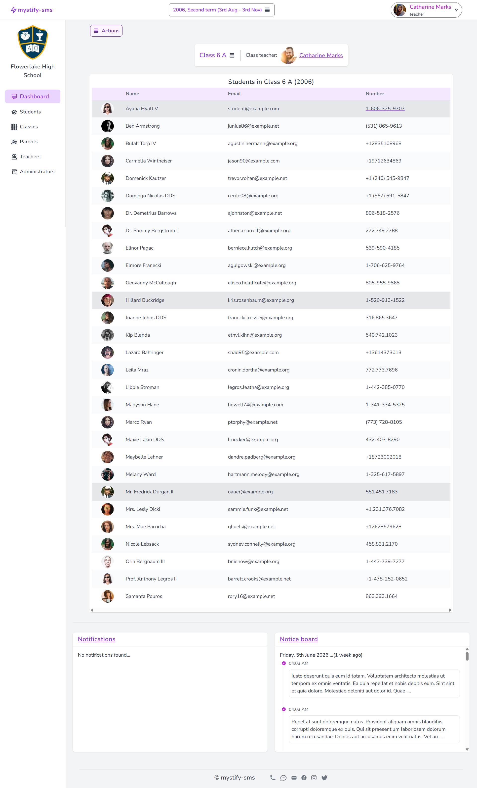
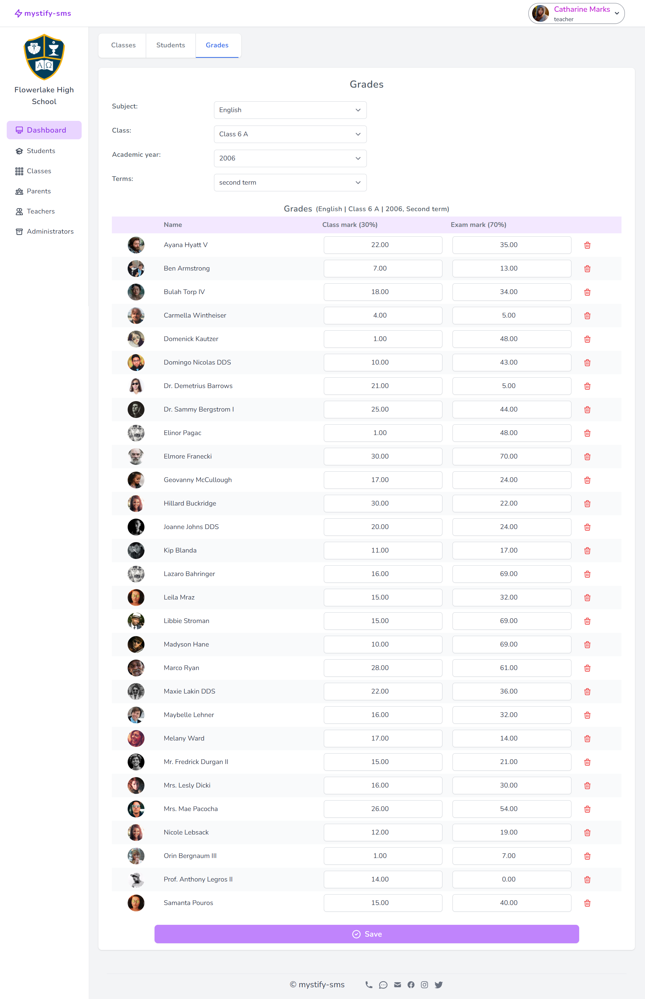
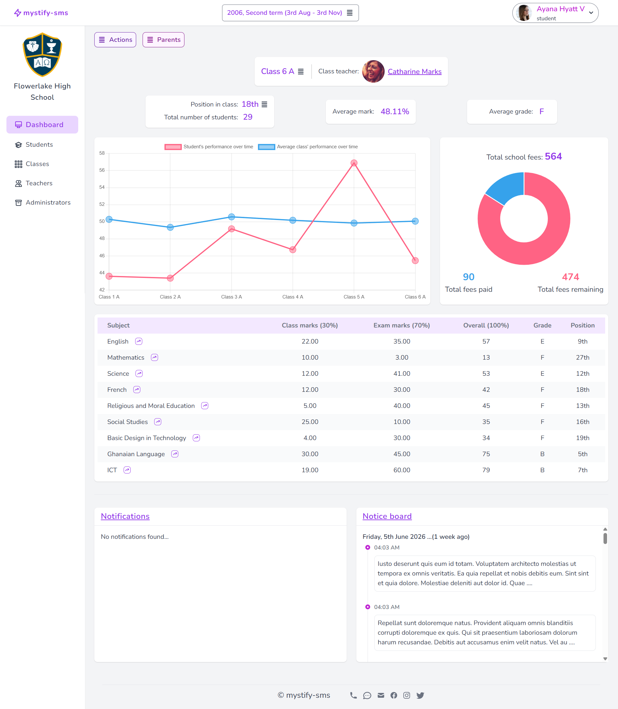
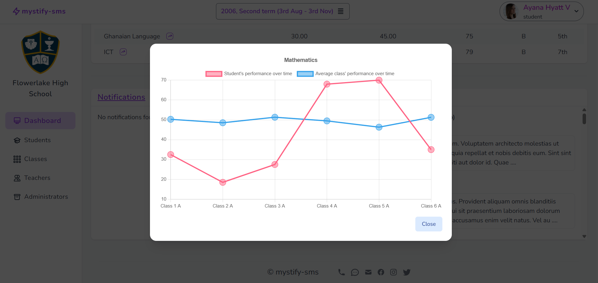
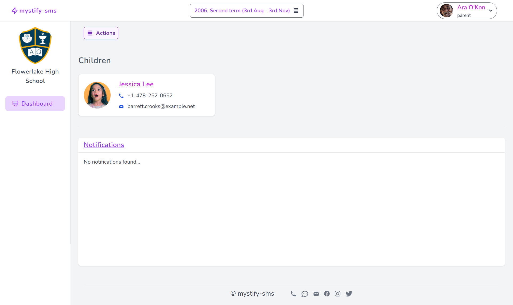

# mystify-sms

A feature-rich, multi-tenant SaaS web application for managing the day-to-day operations of a school. The platform brings headteachers, administrators, teachers, students, and parents together in one place, replacing the patchwork of spreadsheets, paper records, and ad-hoc messaging that many schools still rely on.

Each registered school operates as an isolated tenant: its users, classes, academic years, terms, grades, fees, and notifications are scoped to that school only. Users can hold multiple roles simultaneously (for example, a teacher who is also a parent) and switch between them from a single account.

## Table of Contents

- [Tech Stack](#tech-stack)
- [Features](#features)
- [Screenshots](#screenshots)
- [Architecture Overview](#architecture-overview)
- [Requirements](#requirements)
- [Getting Started](#getting-started)
  - [Option A: Laravel Sail (Docker)](#option-a-laravel-sail-docker)
  - [Option B: Local PHP / MySQL](#option-b-local-php--mysql)
- [Environment Variables](#environment-variables)
- [Running the App](#running-the-app)
- [Testing](#testing)
- [Deployment](#deployment)
- [Project Structure](#project-structure)
- [License](#license)

## Tech Stack

**Backend**
- PHP 8.0+
- [Laravel 9](https://laravel.com/) (framework)
- [Inertia.js](https://inertiajs.com/) (server-side routing for the SPA)
- [Laravel Sanctum](https://laravel.com/docs/sanctum) (API auth)
- [Laravel Breeze](https://laravel.com/docs/starter-kits#laravel-breeze) (auth scaffolding)
- [Laravel Telescope](https://laravel.com/docs/telescope) (debug & monitoring)
- [Spatie Activity Log](https://spatie.be/docs/laravel-activitylog) (audit trail)
- [Intervention Image](https://image.intervention.io/) (profile picture processing)
- [Pusher](https://pusher.com/) + Laravel broadcasting (real-time notifications)
- [Sentry](https://sentry.io/) (error tracking)
- MySQL 8 (primary database)
- Redis (cache / queues / sessions)

**Frontend**
- [Vue 3](https://vuejs.org/) (composition + options API)
- [Inertia Vue 3 adapter](https://inertiajs.com/client-side-setup)
- [Tailwind CSS 3](https://tailwindcss.com/) + `@tailwindcss/forms`
- [Headless UI](https://headlessui.com/) & [Heroicons](https://heroicons.com/)
- [Chart.js](https://www.chartjs.org/) via `vue-chart-3` (dashboard analytics)
- [FilePond](https://pqina.nl/filepond/) (image uploads with crop / resize / EXIF handling)
- [SweetAlert2](https://sweetalert2.github.io/) (modals & confirmations)
- [Laravel Echo](https://laravel.com/docs/broadcasting#client-side-installation) + `pusher-js` (real-time)
- Laravel Mix / webpack (asset bundling)

**Dev / Ops**
- [Laravel Sail](https://laravel.com/docs/sail) (Docker dev environment with MySQL, Redis, Meilisearch, Mailhog, Selenium)
- PHPUnit (feature + unit tests)
- Prettier + `@prettier/plugin-php` + `prettier-plugin-tailwindcss`

## Features

### Multi-tenant school management
- Each school is an isolated tenant with its own users, classes, academic structure, grading scale, and financial records.
- Headteachers create the school during onboarding; other users join via a request/approval flow.

### Role-based access control
Five roles, enforced server-side through Laravel Policies:
- **Headteacher** — full administrative control over the school.
- **Administrator** — manages users, classes, academic years, terms, and the notice board on behalf of the headteacher.
- **Teacher** — manages assigned classes, records grades, posts notices to their classes.
- **Student** — views their own grades, position in class, fees status, and notices.
- **Parent** — views the academic and financial status of their linked children.

Users with multiple roles (e.g. a teacher who is also a parent) can switch their active role from the navigation bar without logging out.

### Authentication & account management
- Email/password registration with **email verification** (Laravel Breeze).
- Password reset flow.
- Profile picture upload with client-side cropping, resizing, EXIF-orientation correction, and validation (powered by FilePond + Intervention Image).
- In-app password change.

### Role-aware dashboards with analytics
- **Headteacher dashboard:** headline counts for students / parents / teachers / administrators, total school fees billed vs. collected, a line chart of fees collected over time, and a sortable table of students who currently owe fees.
- **Student dashboard:** position in class, average mark, grade for the average, per-subject grades with position per subject, fees status, and line charts comparing the student's performance against the rest of the class — both overall and per subject.
- **Teacher dashboard:** the classes the teacher is assigned to, with quick access to grade entry for the active class.
- **Parent dashboard:** a list of linked children with deep links into each child's record.
- All dashboards are scoped to a selectable **academic term**, so historical snapshots remain accessible.

### Academic structure
- **Academic years** and nested **terms** define the timeline of the school year.
- **Classes** with name + suffix (e.g. "Form 1 A") are created per school and linked to academic years.
- **Class teachers** are assigned per class per academic year.
- **Class students** join classes per academic year, preserving history as students move up.
- **Subjects** are defined per class.

### Grading
- Configurable per-school **grading scale** (mark ranges mapped to grade letters).
- Teachers record marks per student, per subject, per term.
- Automatic computation of:
  - Average mark per student per term.
  - Letter grade for each mark, derived from the school's grading scale.
  - Position in class (overall and per subject), formatted as ordinals (1st, 2nd, 3rd, …).
  - Comparative charts against classmates.

### School fees
- Headteachers/administrators set school fees per student per academic year.
- Payments are recorded per student per academic year.
- The system tracks total billed, total collected, outstanding balance per student, and aggregate collection trends over time.

### Notice board
- Headteachers, administrators, and teachers can post notices.
- Notices are filtered to the relevant audience (whole school or specific class).
- Students and parents see only the notices that apply to them.

### Real-time notifications
- Pusher-backed broadcasting delivers in-app notifications without a page refresh.
- Notifications cover: join-school requests, add-as-parent / add-as-child requests, and other significant school events.
- Both per-user and per-school notification streams are supported (administrators see the school's notifications).

### Join, parent, and child request flows
- **Join school request:** new users request to join an existing school; headteachers/administrators approve or decline.
- **Add as child request:** a parent requests to link a student as their child.
- **Add as parent request:** a student requests to link a user as their parent.
- All flows are bidirectional, audited, and confirmable from a notifications inbox.

### Auditing & observability
- All significant model changes are logged via Spatie Activity Log (with batch UUIDs and event names).
- Laravel Telescope is available in local for inspecting requests, queries, jobs, and notifications.
- Sentry integration captures exceptions in both Laravel and the Vue frontend.

## Screenshots

### Headteacher / Administrator
| Dashboard (counts + fees) | Students Owing Fees |
| --- | --- |
|  |  |


| Classes                                              | Class Detail                                       | Academic Years & Terms                                                 |
|------------------------------------------------------|----------------------------------------------------|------------------------------------------------------------------------|
|  |  |  |

### Teacher
| Teacher Dashboard | Grade Entry |
| --- | --- |
|  |  |

### Student
| Student Dashboard | Performance vs. Class |
| --- | --- |
|  |  |

### Parent
| Parent Dashboard |
| --- |
|  |

## Architecture Overview

mystify-sms is an [Inertia.js](https://inertiajs.com/) "modern monolith": Laravel handles routing, authorization, and data fetching, and returns Vue 3 page components rendered client-side. There is no separate REST API to maintain for the SPA.

- HTTP requests hit Laravel routes (`routes/web.php`, `routes/auth.php`).
- Controllers in `app/Http/Controllers/` resolve data via Eloquent models in `app/Models/`.
- Controllers respond with `Inertia::render('PageName', $props)`, which loads a Vue page from `resources/js/Pages/`.
- The `HandleInertiaRequests` middleware shares the authenticated user, permissions, flash messages, and notifications with every page.
- Real-time updates are pushed to the client over Pusher channels using Laravel Echo.
- Authorization is centralized in `app/Policies/` and exposed to the frontend via a computed `permissions` attribute on the `User` model.

## Requirements

- PHP **8.0.2** or higher with the standard Laravel extensions (`mbstring`, `openssl`, `pdo_mysql`, `intl`, `gd`, `xml`, `tokenizer`, `ctype`, `json`, `bcmath`, `fileinfo`).
- Composer 2.x.
- Node.js 16+ and npm.
- MySQL 8 (or compatible).
- Redis (recommended for cache / sessions / queues, required if `*_DRIVER=redis`).
- A Pusher account (or compatible service) for broadcasting.
- Optionally Docker + Docker Compose if using Laravel Sail.

## Getting Started

### Option A: Laravel Sail (Docker)

Sail is the easiest path — it spins up PHP, MySQL, Redis, Meilisearch, Mailhog, and Selenium in containers.

```bash
# 1. Clone the repository
git clone <repo-url> mystify-sms
cd mystify-sms

# 2. Copy the environment file
cp .env.example .env

# 3. Install PHP dependencies (one-time, via a throwaway composer container)
docker run --rm \
    -u "$(id -u):$(id -g)" \
    -v "$(pwd):/var/www/html" \
    -w /var/www/html \
    laravelsail/php81-composer:latest \
    composer install --ignore-platform-reqs

# 4. Start the stack
./vendor/bin/sail up -d

# 5. Generate the application key
./vendor/bin/sail artisan key:generate

# 6. Run migrations (and optionally seed)
./vendor/bin/sail artisan migrate
./vendor/bin/sail artisan db:seed   # optional

# 7. Install front-end dependencies and build assets
./vendor/bin/sail npm install
./vendor/bin/sail npm run dev
```

The app is then reachable at `http://localhost` (override via `APP_PORT` in `.env`). Mailhog's UI is at `http://localhost:8025`.

### Option B: Local PHP / MySQL

```bash
# 1. Clone and enter the project
git clone <repo-url> mystify-sms
cd mystify-sms

# 2. Install dependencies
composer install
npm install

# 3. Configure environment
cp .env.example .env
php artisan key:generate

# 4. Create the database referenced by DB_DATABASE in .env, then:
php artisan migrate
php artisan db:seed   # optional

# 5. Build front-end assets
npm run dev           # development build
# or: npm run watch   # rebuild on file changes
# or: npm run prod    # production build

# 6. Serve the application
php artisan serve
```

The app is then reachable at `http://127.0.0.1:8000`.

## Environment Variables

Edit `.env` after copying it from `.env.example`. The keys that most often need attention:

| Key | Purpose |
| --- | --- |
| `APP_NAME`, `APP_URL` | Application identity and base URL. |
| `DB_CONNECTION`, `DB_HOST`, `DB_PORT`, `DB_DATABASE`, `DB_USERNAME`, `DB_PASSWORD` | MySQL connection. |
| `BROADCAST_DRIVER` | Set to `pusher` for real-time notifications. |
| `PUSHER_APP_ID`, `PUSHER_APP_KEY`, `PUSHER_APP_SECRET`, `PUSHER_APP_CLUSTER` | Pusher credentials. |
| `MIX_PUSHER_APP_KEY`, `MIX_PUSHER_APP_CLUSTER` | Exposed to the Vue client at build time. |
| `MAIL_*` | Outbound mail (Mailhog by default under Sail). |
| `REDIS_HOST`, `REDIS_PASSWORD`, `REDIS_PORT` | Redis connection. |
| `SENTRY_LARAVEL_DSN`, `SENTRY_TRACES_SAMPLE_RATE` | Error tracking. Leave blank to disable. |
| `FILESYSTEM_DISK` | Storage disk for uploads (e.g. profile pictures). Run `php artisan storage:link` if using `public`. |

Anything client-visible must be prefixed with `MIX_` and rebuilt via `npm run dev` / `npm run prod`.

## Running the App

Common commands during day-to-day development:

```bash
# Backend
php artisan serve                  # or use Sail
php artisan migrate:fresh --seed   # reset the database
php artisan tinker                 # REPL
php artisan telescope:install      # one-time, if not yet installed

# Frontend
npm run dev                        # one-off dev build
npm run watch                      # rebuild on change
npm run hot                        # HMR via webpack-dev-server
npm run prod                       # minified production build

# Queue worker (if QUEUE_CONNECTION != sync)
php artisan queue:work
```

## Testing

The project uses PHPUnit with separate feature and unit suites under `tests/`.

```bash
# All tests
php artisan test
# or
vendor/bin/phpunit

# Under Sail
vendor/bin/sail php artisan test

# A single file
php artisan test tests/Feature/GradeControllerTest.php

# A single test method
php artisan test --filter=test_method_name
```

Feature tests cover every controller and every model (academic years, terms, classes, class-teacher and class-student pivots, grades, school fees, notice board, notifications, join/add-as-parent/add-as-child requests, FilePond uploads, and authentication). They use Laravel's `RefreshDatabase` trait, so a writable test database connection is required (see `phpunit.xml`).

## Deployment

Two helper scripts ship with the repository:

- **`local_deploy.sh`** — runs the test suite, pushes the current branch, fast-forwards `production` to `main`, and pushes `production`. Intended to be run from a developer machine after committing.
- **`server_deploy.sh`** — intended to run on the server. It puts the app into maintenance mode, resets the working tree to `origin/deploy`, installs production composer dependencies, caches config / routes / views, runs migrations with `--force`, and brings the app back up.

For a production deploy you typically also want to:

```bash
npm run prod              # build minified assets
php artisan storage:link  # if using the public disk
php artisan queue:restart # if running queue workers
```

## Project Structure

```
app/
├── Console/          Artisan command definitions
├── Http/
│   ├── Controllers/  Feature controllers (dashboard, classes, grades, fees, requests, …)
│   ├── Middleware/   Includes HandleInertiaRequests for shared props
│   └── Requests/     Form request validation
├── Models/           Eloquent models (School, User, ClassModel, Term, Grade, SchoolFees, …)
├── Notifications/    Laravel notification classes (Pusher-backed)
└── Policies/         Authorization rules per model

resources/js/
├── Pages/            Inertia Vue pages (one per route group)
├── Layouts/          Authenticated / Guest / role-specific layouts
├── Components/       Reusable Vue components (forms, tables, charts, modals)
└── *_actions.js      Per-role navigation/action definitions

routes/
├── web.php           Inertia + web routes
├── auth.php          Breeze auth routes
├── api.php           Sanctum-protected API routes
└── channels.php      Broadcasting channel authorization

database/
├── migrations/       Schema (schools, users, academic_years, terms, classes, grades, fees, …)
├── factories/        Model factories used in tests and seeding
└── seeders/          DatabaseSeeder + SchoolSeeder

tests/
├── Feature/          End-to-end controller and model tests
└── Unit/             Isolated unit tests
```

## License

This project is currently distributed under the same MIT license as the underlying Laravel framework. See `composer.json` for details.
